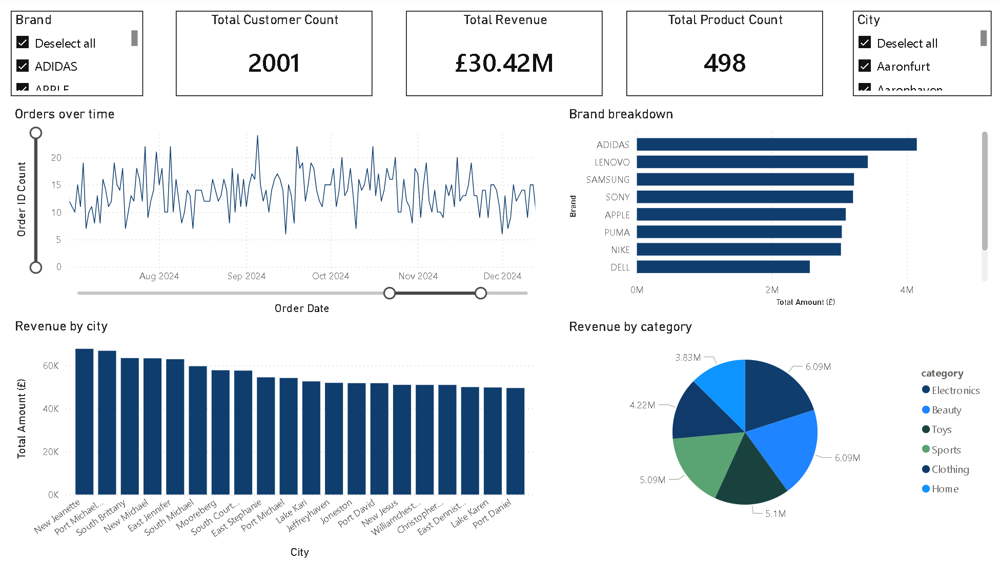
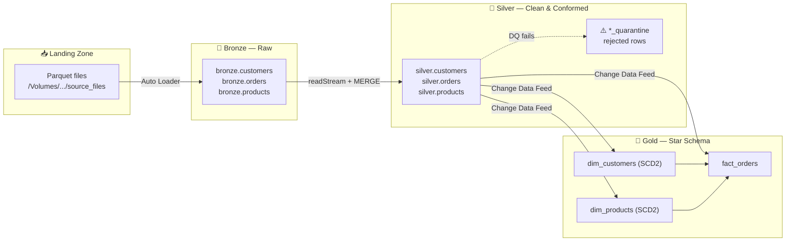
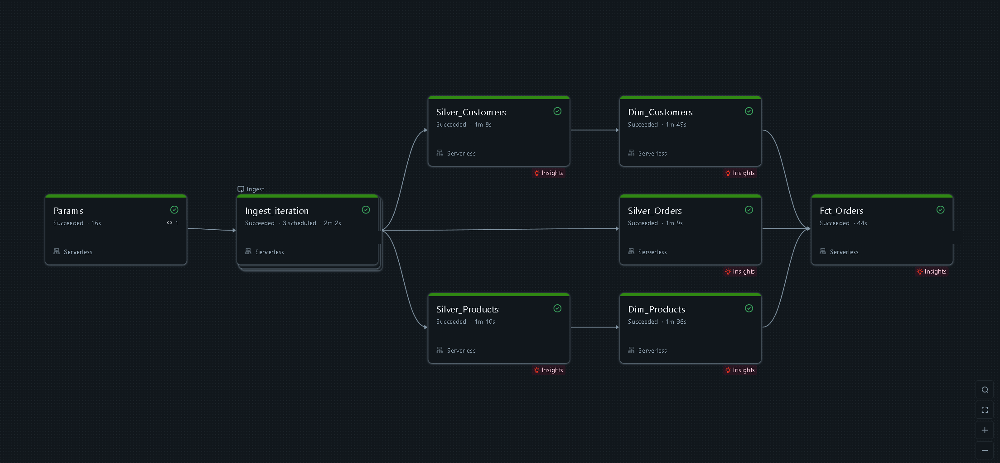
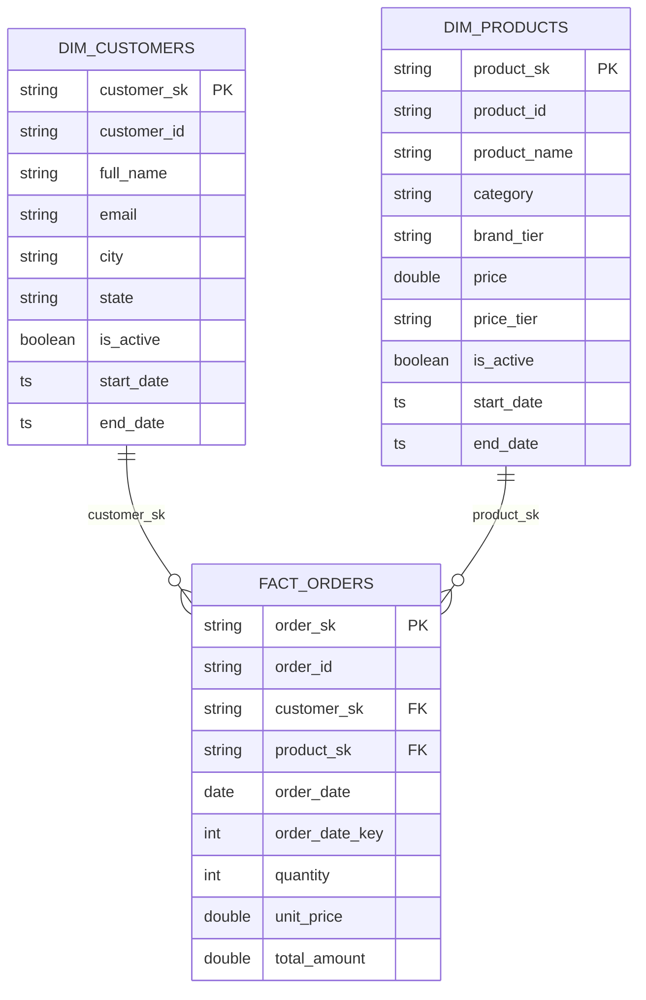
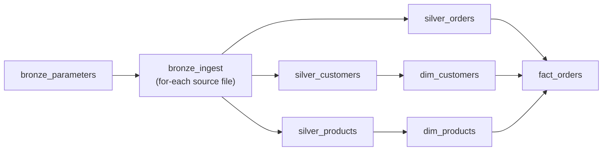

<div align="center">

# 🛒 Ecommerce Lakehouse — Databricks Pipeline

### Streaming **Bronze → Silver → Gold** ETL on the Databricks Lakehouse, built with PySpark, Delta Lake & Auto Loader

[](https://www.databricks.com/)
[](https://delta.io/)
[](https://spark.apache.org/)
[](https://www.python.org/)

[](https://github.com/TihimRahman/Ecommerce-Databricks/actions/workflows/validate-bundle.yml)
[](https://github.com/TihimRahman/Ecommerce-Databricks/actions/workflows/tests.yml)
[](LICENSE)

<em>Raw parquet drops in → clean, deduplicated, quality-checked data flows out → ready-to-query star schema with full history.</em>

</div>

---

## 📊 Data Visualisation

Power BI dashboard connected live to the Gold layer — 2,001 customers, £30.42M revenue, 498 products across 6 categories and 8 brands.



---

## ✨ TL;DR

An end-to-end **incremental** data platform for e-commerce data (`customers`, `orders`, `products`). Files land in a Unity Catalog Volume, and a chained set of streaming notebooks promotes them through three curated layers — each one adding cleansing, validation, and business meaning — landing in a query-ready **star schema** with **SCD Type 2** history.

| | |
|---|---|
| 🔄 **Incremental everywhere** | Auto Loader + Structured Streaming with `availableNow` triggers — only new data is processed |
| 🧹 **Quality-first** | Bad rows are *quarantined*, never silently dropped |
| 🕰️ **Full history** | SCD Type 2 dimensions track every change with surrogate keys & validity windows |
| ⚡ **Change Data Feed** | Gold reacts only to what actually changed in Silver |
| 🧩 **Idempotent** | Delta `MERGE` upserts make every layer safe to re-run |

---

## 🏛️ Architecture



> **Catalog:** `tihim_project`  ·  **Schemas:** `bronze` → `silver` → `gold`  ·  **Ops/state:** `/Volumes/tihim_project/ops/stream_state/...`

---

## 📸 Pipeline in Action

A full end-to-end run as a **Databricks Workflow** — Bronze ingest fans out to the three Silver streams, which feed the SCD2 dimensions before the fact is built. Every task green, running on **Serverless** compute.



---

## 📂 Repository Layout

```
Ecommerce-Databricks/
├── Bronze/
│   ├── Parameters.ipynb      # 🎛️  Dataset list → driven into the ingest loop
│   └── Source_Bronze.ipynb   # 📥  Auto Loader: parquet → bronze Delta tables
├── Silver/
│   ├── Silver_Customers.ipynb  # 🧼  Clean • validate • dedup • upsert
│   ├── Silver_Orders.ipynb     # 🧮  Derive unit_price • range checks • upsert
│   └── Silver_Products.ipynb   # 🏷️  Price/brand tiers • upsert
└── Gold/
    ├── Dim_Customers.ipynb   # 🕰️  SCD Type 2 customer dimension
    ├── Dim_Products.ipynb    # 🕰️  SCD Type 2 product dimension
    └── Fct_Orders.ipynb      # ⭐  Fact table w/ surrogate-key lookups
```

---

## 🥉 Bronze — Raw Ingestion

> **Goal:** land everything, lose nothing.

- **Auto Loader** (`cloudFiles`) incrementally streams **parquet** from the landing volume — no manual file tracking.
- **Schema location + checkpoints** give automatic schema evolution and exactly-once progress.
- Each row is stamped with `ingestion_date` and its `source_file` for full lineage.
- `Parameters.ipynb` publishes the dataset list (`customers`, `orders`, `products`) via **task values**, so one parameterized notebook ingests every source.

```python
spark.readStream.format("cloudFiles")
    .option("cloudFiles.format", "parquet")
    .option("cloudFiles.schemaLocation", schema_path)
    .load(source_path)
    .withColumn("ingestion_date", F.current_timestamp())
    .withColumn("source_file", F.col("_metadata.file_path"))
```

---

## 🥈 Silver — Clean, Validate, Conform

> **Goal:** trustworthy, deduplicated, business-ready records.

Each Silver notebook follows the same battle-tested pattern via `foreachBatch`:

1. **🧹 Clean** — trim/normalize casing, cast types, round currency, derive helpers (`unit_price`, email `domain`, `price_tier`, `brand_tier`).
2. **🔎 Flag** — build a `dq_reason` string from rule checks.
3. **🚧 Quarantine** — rows failing any rule are appended to a `*_quarantine` table with `batch_id` + `rejected_at` (audited, never dropped).
4. **🪟 Deduplicate** — keep the latest record per key via a `row_number()` window on `ingestion_date`.
5. **🔀 Upsert** — null-safe (`<=>`) Delta `MERGE` updates only changed columns and inserts new keys.
6. **📡 Change Data Feed** — enabled on every Silver table so Gold consumes *only* deltas.

| Dataset | Highlight checks |
|---|---|
| **Customers** | non-null id/name/email · regex email validation · `full_name` & `domain` derivation |
| **Orders** | quantity & amount ceilings · no negatives · no future `order_date` · computed `unit_price` |
| **Products** | non-null id/name · non-negative price · `price_tier` & `brand_tier` bucketing |

---

## 🥇 Gold — Star Schema & History

> **Goal:** fast, analytics-ready dimensional model.

Reads the **Silver Change Data Feed** (`insert` + `update_postimage` only) and dedups to the latest commit per key.

### 🕰️ `dim_customers` & `dim_products` — SCD Type 2
- **Tracked changes** (e.g. customer city/state, product price) **expire** the current row (`is_active = false`, `end_date` set) and **insert a new version**.
- **Non-tracked attributes** (e.g. email, product name) are updated **in place** on the active row.
- Deterministic **surrogate keys** via `sha2(... , 256)` over the natural key + timestamp; open records carry `end_date = 2999-12-31`.

### ⭐ `fact_orders`
- Joins each order to the **active** customer & product dimension to resolve `customer_sk` / `product_sk`.
- Unmatched lookups fall back to the **`-1` unknown member** (no orphan facts).
- Adds an integer **`order_date_key`** (`yyyyMMdd`) for clean date-dimension joins.
- `MERGE` upsert keeps the fact in sync with order revisions.

---

## 🗂️ Data Model

The Gold layer is a classic **star schema** — one fact surrounded by conformed dimensions.



### 📖 Data Dictionary — Gold

<sub>Click a table to expand its full column reference.</sub>

<br/>

<details>
<summary><b>⭐ <code>gold.fact_orders</code></b> — grain: one row per order</summary>

<br/>

| Column | Type | Description |
|---|---|---|
| `order_sk` | string | Surrogate key — `sha2(order_id)` |
| `order_id` | string | Natural order identifier |
| `customer_sk` | string | FK → `dim_customers` (`-1` = unknown) |
| `product_sk` | string | FK → `dim_products` (`-1` = unknown) |
| `order_date` | date | Date the order was placed |
| `order_date_key` | int | `yyyyMMdd` integer for date joins |
| `quantity` | int | Units ordered |
| `unit_price` | double | `total_amount / quantity` |
| `total_amount` | double | Order line value |
| `etl_updated_at` | timestamp | Last ETL touch |

</details>

<details>
<summary><b>🕰️ <code>gold.dim_customers</code></b> — SCD Type 2, one row per customer version</summary>

<br/>

| Column | Type | Description |
|---|---|---|
| `customer_sk` | string | Surrogate key — `sha2(customer_id ‖ update_date)` |
| `customer_id` | string | Natural key |
| `full_name`, `email`, `domain` | string | Conformed attributes (updated in place) |
| `city`, `state` | string | **Tracked** attributes — a change creates a new version |
| `is_active` | boolean | `true` = current version |
| `start_date` / `end_date` | timestamp | Validity window (open = `2999-12-31`) |

</details>

<details>
<summary><b>🕰️ <code>gold.dim_products</code></b> — SCD Type 2, one row per product version</summary>

<br/>

| Column | Type | Description |
|---|---|---|
| `product_sk` | string | Surrogate key — `sha2(product_id ‖ update_date)` |
| `product_id` | string | Natural key |
| `product_name`, `category`, `brand`, `brand_tier` | string | Conformed attributes (updated in place) |
| `price`, `price_tier` | double / string | `price` is **tracked** — a change creates a new version |
| `is_active` | boolean | `true` = current version |
| `start_date` / `end_date` | timestamp | Validity window (open = `2999-12-31`) |

</details>

---

## 🧪 Sample Data

The [`Sample/`](Sample) folder ships ready-to-run parquet so you can exercise the pipeline end to end — including the failure and history paths, not just the happy case.

| Folder | What it contains | What it demonstrates |
|---|---|---|
| 📥 [`Sample/Landing Data`](Sample/Landing%20Data) | Clean `customers` / `orders` / `products` | The full **Bronze → Silver → Gold** happy path |
| 🚧 [`Sample/Quarantine DQ Checks`](Sample/Quarantine%20DQ%20Checks) | Rows with nulls, bad emails, out-of-range values | Silver **flags & quarantines** bad data instead of dropping it |
| 🕰️ [`Sample/SCD Tests`](Sample/SCD%20Tests) | Updated cities / prices for existing keys | Gold **SCD Type 2** expires old rows and inserts new versions |

> Run them in that order on the same keys to watch a record flow in, get partially rejected, then evolve through history.

---

## 🚀 Getting Started

> **Prerequisites:** A Databricks workspace with **Unity Catalog** enabled and a running cluster (DBR with Delta + Auto Loader).

1. **Create the catalog & volumes** expected by the notebooks:
   ```sql
   CREATE CATALOG IF NOT EXISTS tihim_project;
   CREATE SCHEMA  IF NOT EXISTS tihim_project.bronze;
   CREATE SCHEMA  IF NOT EXISTS tihim_project.silver;
   CREATE SCHEMA  IF NOT EXISTS tihim_project.gold;
   CREATE VOLUME  IF NOT EXISTS tihim_project.landing.source_files;
   CREATE VOLUME  IF NOT EXISTS tihim_project.ops.stream_state;
   ```
2. **Import** this repo into your workspace (Repos → Add Repo → this Git URL).
3. **Load source data.** Copy the ready-made files from [`Sample/Landing Data`](Sample/Landing%20Data) (or your own) into
   `/Volumes/tihim_project/landing/source_files/<name>/`, where `<name>` is `customers`, `orders`, or `products`.
4. **Run the layers in order:**
   - 🥉 `Bronze/Source_Bronze.ipynb` (parameterized by `filename`, fed from `Parameters.ipynb`)
   - 🥈 `Silver/Silver_*.ipynb`
   - 🥇 `Gold/Dim_*` then `Gold/Fct_Orders` (facts depend on dims)
5. **Query the Gold layer:**
   ```sql
   SELECT c.state, SUM(f.total_amount) AS revenue
   FROM   tihim_project.gold.fact_orders   f
   JOIN   tihim_project.gold.dim_customers c
          ON f.customer_sk = c.customer_sk
   GROUP  BY c.state
   ORDER  BY revenue DESC;
   ```

> 💡 **Tip:** Prefer one-click, end-to-end runs? Deploy the whole pipeline as code — see below.

---

## 📦 Deploy as Code (Asset Bundle)

The entire pipeline is defined as a **[Databricks Asset Bundle](databricks.yml)** — one job, the full Bronze → Silver → Gold DAG, on a shared cluster. No manual wiring in the UI.

```bash
databricks bundle validate              # check the config
databricks bundle deploy -t dev         # upload notebooks + create the job
databricks bundle run medallion_pipeline -t dev
```

The job graph mirrors the real data dependencies:



> ⚙️ Set your `workspace.host` (and, if not on AWS, the `node_type_id`) in [`databricks.yml`](databricks.yml) before deploying.

---

## ✅ Tests

The Silver cleaning/validation rules and the Gold SCD2 decision logic are
factored into [`src/transforms.py`](src/transforms.py) so the exact code the
notebooks use is unit-tested — no Databricks workspace required. Tests run on
every push via GitHub Actions.

```bash
pip install -r requirements-dev.txt
pytest -q
```

Coverage includes email/null/range/ceiling/future-date data-quality rules,
`unit_price` derivation, dedup-by-latest, and the SCD2 tracked-vs-in-place
classification (city/state change ⇒ new version; email/name change ⇒ in place).

> **Tip:** `pip install pre-commit && pre-commit install` keeps notebook outputs
> stripped automatically on every commit (see `.pre-commit-config.yaml`).

---

## 🧰 Tech Stack

**Databricks Lakehouse** · **Delta Lake** (ACID, `MERGE`, Change Data Feed) · **Auto Loader** (`cloudFiles`) · **Spark Structured Streaming** (`foreachBatch`, `availableNow`) · **Unity Catalog** (catalog / schema / volumes) · **PySpark**

---

## 🗺️ Design Principles

- **Idempotency** — every write is a `MERGE`; re-running a layer never duplicates data.
- **Fail loud, lose nothing** — bad data is quarantined and auditable, not discarded.
- **Incremental by default** — CDF + streaming checkpoints mean each run touches only new/changed rows.
- **Separation of concerns** — Bronze preserves raw, Silver conforms, Gold serves analytics.

---

<div align="center">

**[TihimRahman/Ecommerce-Databricks](https://github.com/TihimRahman/Ecommerce-Databricks)** · Built by Tihim Rahman

</div>
